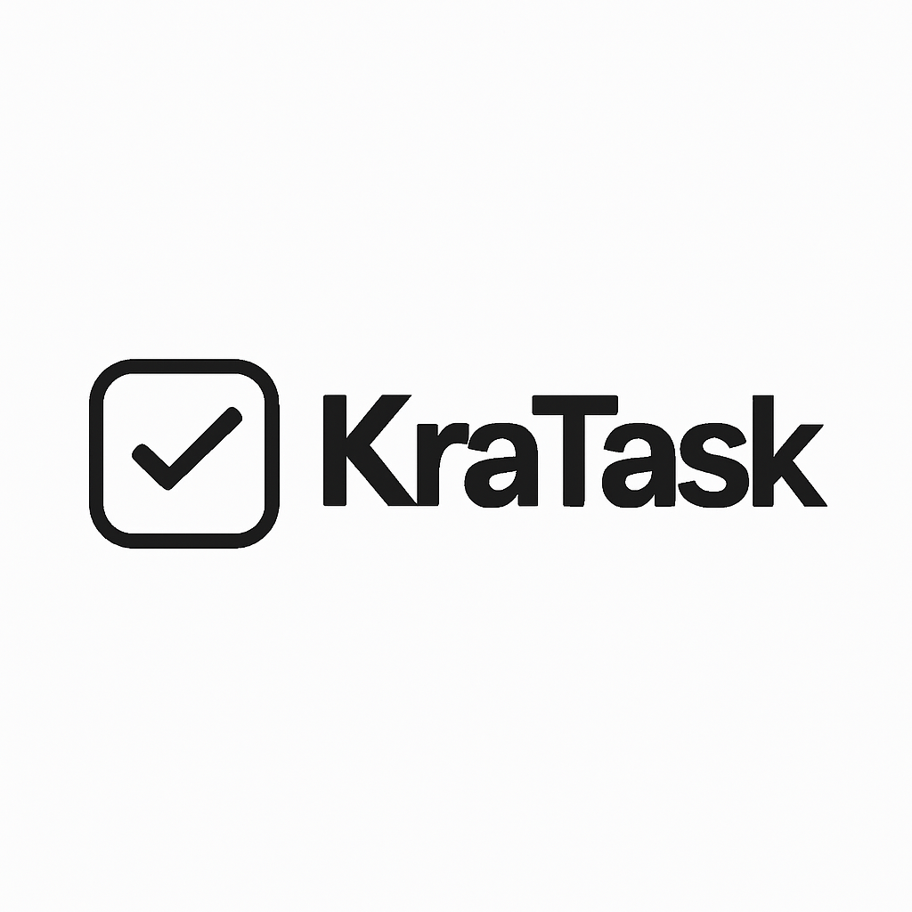

# KraTask - Канбан-доска для macOS

**KraTask** - это современное приложение для управления задачами в стиле канбан-доски, разработанное специально для macOS. Приложение позволяет эффективно организовывать проекты, отслеживать прогресс задач и повышать продуктивность.

## ✨ Особенности

- 🎯 **Интуитивный канбан-интерфейс** - Drag & Drop для перемещения задач между колонками
- 📱 **Адаптивный дизайн** - Оптимальные размеры колонок под содержимое
- 🔍 **Поиск и фильтрация** - Быстрый поиск задач по названию
- 🎨 **Современный UI** - Красивый и функциональный интерфейс
- 💾 **Локальное хранение** - Все данные сохраняются локально с помощью Core Data
- 🚀 **Быстрая работа** - Оптимизированное приложение для macOS

## 🚀 Установка

### Скачать готовое приложение

1. Перейдите в раздел [Releases](https://github.com/Krav13/KraTask-Releases/releases)
2. Скачайте последний релиз `KraTask-v1.1.zip`
3. Распакуйте архив
4. Перетащите `KraTask.app` в папку Applications
5. Запустите приложение из папки Applications

### ⚠️ Важно! Первый запуск

При первом запуске macOS может показать предупреждение о безопасности:

1. **Если появилось сообщение "KraTask не может быть открыт"**:
   - Перейдите в **Системные настройки** → **Конфиденциальность и безопасность**
   - Найдите раздел **"Безопасность"**
   - Нажмите **"Все равно открыть"** рядом с KraTask
   - Подтвердите действие

2. **Альтернативный способ**:
   - Щелкните правой кнопкой по `KraTask.app`
   - Выберите **"Открыть"**
   - Нажмите **"Открыть"** в диалоговом окне

После этого приложение будет запускаться без предупреждений!

## 📋 Системные требования

- **macOS**: 15.5 или новее
- **Архитектура**: Apple Silicon (M1/M2/M3) или Intel x64
- **Свободное место**: 10 MB

## 🎯 Как использовать

1. **Создание проекта**: Нажмите "+" в боковой панели для создания нового проекта
2. **Добавление задач**: Нажмите "+ Новая задача" для создания задачи
3. **Перемещение задач**: Перетащите задачу между колонками для изменения статуса
4. **Поиск**: Используйте поле поиска для быстрого поиска задач
5. **Фильтрация**: Нажмите "Фильтры" для настройки отображения

## 🐛 Сообщения об ошибках

Если вы нашли ошибку, пожалуйста:
- Создайте [Issue](https://github.com/Krav13/KraTask-Releases/issues) с подробным описанием проблемы
- Или напишите в [Telegram](https://t.me/itskrav) для быстрой обратной связи

## 📞 Поддержка

Если у вас есть вопросы или предложения:
- Создайте [Issue](https://github.com/Krav13/KraTask-Releases/issues) 
- Напишите в [Telegram](https://t.me/itskrav)
- Подписывайтесь на [мой канал](https://t.me/lezhanka_krava) для обновлений

## 📺 Автор

**Krav13** - разработчик KraTask
- 🎥 [Мой канал](https://t.me/lezhanka_krava) - обновления и новости
- 💬 [Telegram](https://t.me/itskrav) - обратная связь и поддержка
- 🐙 [GitHub](https://github.com/Krav13) - другие проекты

## 📝 Лицензия

Этот проект распространяется под лицензией MIT. См. файл `LICENSE` для получения дополнительной информации.

---

**KraTask** - делайте больше, планируйте лучше! 🚀
